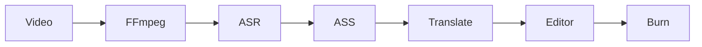

# Hikaru-Sub — Agent 指南

AI 字幕桌面应用：导入视频 → 本地 ASR 转录 → LLM 批量翻译 → 字幕校对编辑 → FFmpeg 压制。

## 技术栈

| 层级 | 选型 |
|------|------|
| 包管理 | **pnpm workspace**（根目录与 `packages/*`） |
| 桌面壳 | Tauri 2 + Rust |
| 前端 | React 19 + TypeScript + Vite |
| 样式 | Tailwind CSS 4（`src/styles/index.css`） |
| 状态 | Zustand（`src/stores/`） |
| 字幕格式 | `@hikaru/ass-core`（`packages/ass-core/`） |
| ASR | Python sidecar（`asr-service/`，可插拔引擎） |
| 翻译 | OpenAI 兼容 API 适配器（前端） |
| 音视频 | 系统 FFmpeg（首期） |

## 常用命令

```bash
pnpm install
pnpm dev              # 仅 Vite 前端
pnpm tauri dev        # Tauri 桌面开发
pnpm build            # 构建前端
pnpm tauri build      # 打包桌面应用
```

**始终使用 pnpm**，不要用 npm/yarn。workspace 根目录安装依赖时加 `-w`。

## 目录结构

```
src/                          # React 前端
  components/
    layout/                   # AppLayout、Sidebar、StatusBar
    workflow/                 # 导入、转录、翻译、压制、设置
    editor/                   # 字幕编辑器
    player/                   # 视频预览 + ASS 叠加
  stores/                     # ui、project、playback、task
  services/                   # Tauri invoke 封装
  types/                      # 共享 TS 类型
src-tauri/                    # Rust 后端
  src/
    ffmpeg.rs                 # FFmpeg 检测、音轨提取、视频信息、波形提取
    asr.rs                    # ASR sidecar 进程管理 + HTTP 代理
    ass.rs                    # ASS 文件读写
    asset_scope.rs            # Tauri asset protocol 动态授权
    project.rs                # .hikaru/project.json
    settings.rs               # 全局设置持久化
    transcode.rs              # 不兼容视频编码的代理视频转码与缓存
packages/ass-core/              # ASS 解析/序列化（workspace 包）
asr-service/                  # Python ASR sidecar（FastAPI HTTP）
  main.py                     # 入口：选端口 + uvicorn + stdout 就绪协议
  server.py                   # FastAPI 路由
  jobs.py                     # JobManager：后台线程转录 + 进度/取消
  engines/                    # AsrEngine 抽象 + faster-whisper + registry
```

## 架构边界

- **Tauri Rust**：文件 I/O、FFmpeg、音频波形、视频代理转码、启动 ASR sidecar、项目元数据
- **React**：全部 UI、ASS 文本编辑、翻译 API 调用
- **Python sidecar**：ASR 推理，通过 HTTP localhost 通信，不阻塞 UI
- **ass-core**：ASS 是唯一字幕数据交换格式；内存模型为 `SubtitleCue`，保存时按配置输出行内合并或分离双行



## 核心数据模型

### 项目 `.hikaru/project.json`

与视频同目录的 `.hikaru/` 文件夹，含 `project.json`、`audio.wav`、`subtitles.ass`。翻译后字幕保存为 `subtitles.translated.ass`。

### SubtitleCue（逻辑字幕条）

```typescript
interface SubtitleCue {
  id: string
  startMs: number
  endMs: number
  primaryText: string      // 原文
  secondaryText?: string   // 译文
  style: string
  layer: number
}
```

双语 ASS 默认使用行内合并：`译文 / 原文` 写入一条 Dialogue。用户可在设置中切换为分离双行：`Primary`（原文）+ `Secondary`（译文），同时间轴两行 Dialogue。

### 视频编辑兼容策略

编辑页优先通过 Tauri asset protocol 直接加载原视频。WebView2 不支持的编码（如 HEVC/H.265、VP9、AV1）会通过 FFmpeg 生成 480p H.264 全关键帧代理视频：

```text
-vf scale=-2:480 -c:v libx264 -preset ultrafast -g 1 -crf 22 -c:a aac -b:a 128k -movflags +faststart
```

代理视频写入应用缓存目录 `transcode/*.mp4`，用于快速 seek；时间轴另行提取音频波形用于细致对轴。

## 已实现 Tauri Commands

| Command | 职责 |
|---------|------|
| `create_project` | 初始化 `.hikaru/project.json` |
| `open_project` | 加载已有项目 |
| `check_ffmpeg` | 检测 FFmpeg |
| `get_settings` / `set_settings` | 全局配置 |
| `extract_audio` | FFmpeg 提取 16kHz WAV + 进度事件 |
| `extract_waveform` | 提取音频波形峰值数据 |
| `path_exists` | 判断文件/目录是否存在 |
| `list_asr_engines` | 列出 sidecar 已注册引擎及可用性（按需拉起 sidecar） |
| `start_asr` | 创建转录任务，返回 jobId |
| `get_asr_progress` | 轮询任务进度/片段 |
| `cancel_asr` | 取消转录任务 |
| `check_asr_model` | 检查本地 ASR 模型状态 |
| `download_asr_model` | 下载 ASR 模型 |
| `get_model_download_progress` | 获取 ASR 模型下载进度 |
| `save_ass_text` / `load_ass_text` | ASS 文件读写 |
| `get_video_info` | 获取视频分辨率、时长等元信息 |
| `allow_asset_path` | 将本地视频/代理视频路径加入 asset scope |
| `detect_video_codec` | 检测视频编码格式 |
| `start_transcode` | 启动代理视频转码 |
| `check_transcode_progress` | 查询代理视频转码状态 |
| `stop_transcode` | 清理转码任务记录 |

计划中 command：`burn_subtitles`（FFmpeg 压制输出向导）。

新增 command 时：在 `src-tauri/src/` 实现 → `lib.rs` 注册 → `src/services/tauri.ts` 封装 → 更新 capabilities 权限。

## 编码规范

1. **最小改动**：只改与任务相关的文件，不顺手重构
2. **遵循现有风格**：命名、目录、import 路径（`@/`、`@hikaru/ass-core`）
3. **类型优先**：前后端共享概念在 `src/types/` 与 `ass-core` 保持一致
4. **不提交密钥**：API Key 走 keychain/设置，不进源码
5. **中文 UI 文案**：用户面向字符串用简体中文
6. **图标用 SVG**：UI 图标一律使用 SVG（统一放 `src/components/layout/NavIcons.tsx`，lucide 风格 `stroke="currentColor"`），不要用 emoji/字符当图标，避免跨平台字形缺失渲染成方块
7. **不编辑计划文件**：`.cursor/plans/` 下的方案文档除非用户明确要求

## 分阶段实现（当前进度）

- [x] 项目脚手架（Tauri + React + Tailwind + Zustand + pnpm workspace）
- [x] `ass-core`：ASS 解析/序列化、双语展开/合并
- [x] 项目管理 + FFmpeg 音轨提取（含 FFmpeg 捆绑/分层解析）
- [x] 导入工作流 UI（ImportView：选视频 → 建项目 → 进入转录；支持打开已有项目并加载 ASS）
- [x] 设置页 UI（SettingsView：FFmpeg/Python 路径、默认引擎、翻译 API/Key、翻译高级配置）
- [x] Python ASR sidecar（AsrEngine 抽象 + faster-whisper 适配器 + HTTP 进度 API）
- [x] 转录工作流 UI（TranscribeView：音轨提取 + 转录进度 + 生成单语 ASS；使用视频实际分辨率，不强制换行）
- [x] OpenAI 兼容翻译管线 + 翻译 UI（TranslateView：批量翻译 + 进度显示 + 术语表/自定义 prompt 支持）
- [x] ASS 文件持久化（转录后自动保存，打开项目时自动加载）
- [x] 字幕合并模式配置（默认行内 `译文 / 原文`，可切换分离双行）
- [x] 字幕编辑器（EditorView：视频播放 + 字幕列表 + 编辑面板 + 局部缩放时间轴 + 音频波形 + 撤销重做）
- [x] 视频播放兼容处理（asset protocol 加载；不兼容编码生成 480p H.264 全关键帧代理视频并缓存）
- [ ] FFmpeg 压制（BurnView 输出向导）
- [ ] 错误处理、任务队列、安装脚本等整体打磨

## 首期不做

在线协作、OCR 硬字幕提取、多音轨选择、macOS 公证/商店发布。
